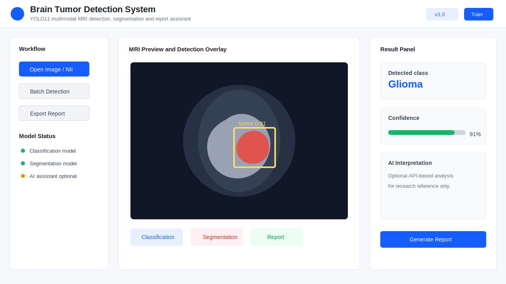
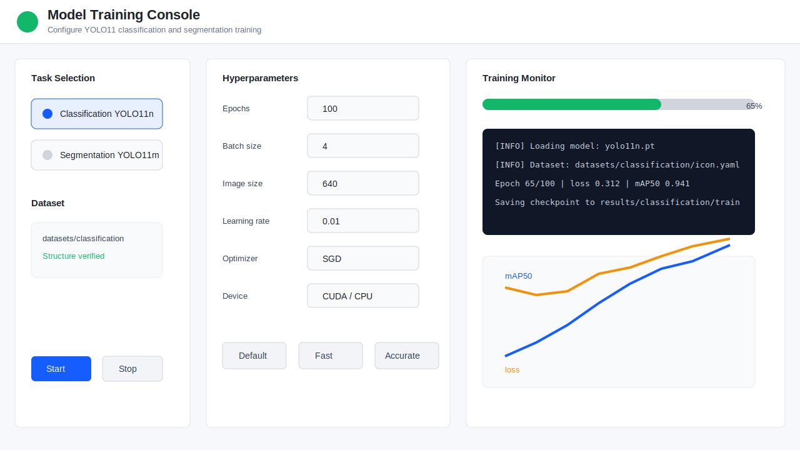
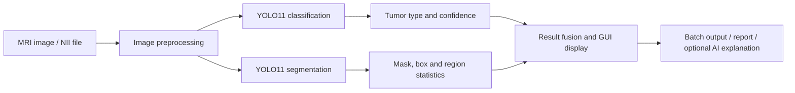
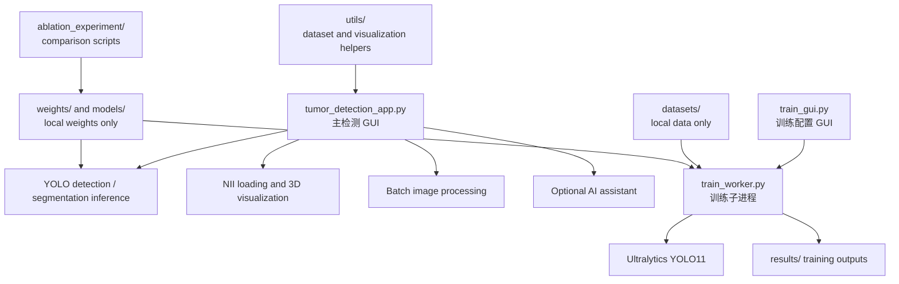

# Brain Tumor Detection System

基于 YOLO11 的脑肿瘤检测、分类和实例分割桌面系统，提供单张影像检测、批量处理、NII/MRI 可视化、训练参数配置、消融实验和可选 AI 辅助解读能力。

> 重要提示：本项目仅用于学习、研究和工程演示，不能替代医生诊断或临床决策。

## 系统亮点

- **双任务支持**：同时覆盖脑肿瘤分类检测和肿瘤区域实例分割。
- **双模型协同**：分类模型识别肿瘤类型，分割模型定位肿瘤区域，可用于更完整的检测展示。
- **医学影像友好**：支持常见图片格式和 NII 医学影像文件，适合 MRI 数据的实验演示。
- **可视化桌面端**：基于 PyQt5 构建主检测界面和训练界面，便于非命令行用户操作。
- **批量处理与报告辅助**：支持批量检测、结果展示、统计信息和可选 AI 辅助解读。
- **公开仓库安全整理**：不提交医学影像、模型权重、训练产物、API Key 和个人敏感信息。

## 界面截图

以下图片为不含真实患者数据的安全界面示意图，用于展示系统布局。实际运行时界面会根据本地模型、数据和系统环境显示真实检测结果。

### 主检测界面



### 模型训练界面



## 运行效果

系统加载训练好的权重后，可以完成以下流程：

1. 选择 MRI 图片或 NII 文件。
2. 调用 YOLO11 分类模型识别肿瘤类别。
3. 调用 YOLO11 分割模型生成肿瘤区域掩膜。
4. 在界面中展示检测框、置信度、分割区域和统计信息。
5. 对文件夹进行批量检测，并汇总处理结果。
6. 可选调用 OpenAI-compatible API 生成辅助说明。

支持的分类类别：

| ID | 类别 | 英文名称 |
| --- | --- | --- |
| 0 | 胶质瘤 | Glioma |
| 1 | 脑膜瘤 | Meningioma |
| 2 | 无肿瘤 | No Tumor |
| 3 | 垂体瘤 | Pituitary |

分割任务输出：

| ID | 类别 | 说明 |
| --- | --- | --- |
| 0 | tumor | 肿瘤区域掩膜 |

## 技术路线



核心技术栈：

- Python 3.8+
- PyQt5 桌面图形界面
- Ultralytics YOLO11
- PyTorch / TorchVision
- OpenCV、NumPy、Pandas、SciPy
- NiBabel、PyVista / PyVistaQt
- OpenAI-compatible API，可选

## 模块架构



主要文件说明：

| 路径 | 说明 |
| --- | --- |
| `tumor_detection_app.py` | 主检测程序，包含图像/NII 加载、检测展示、批量处理、AI 辅助入口 |
| `train_gui.py` | 模型训练可视化界面 |
| `train_worker.py` | 独立训练子进程，避免训练阻塞 GUI |
| `datasets/` | 数据集配置和占位目录，不提交真实医学数据 |
| `weights/` | 训练权重占位目录，不提交 `.pt` 文件 |
| `models/` | YOLO 预训练权重占位目录 |
| `docs/` | 安装、数据集、模型权重说明 |
| `ablation_experiment/` | 消融实验脚本和示例结果 |

## 使用流程

### 1. 安装依赖

```bash
conda create -n brain-tumor-detection python=3.10 -y
conda activate brain-tumor-detection
pip install -r requirements.txt
```

### 2. 放置模型权重

检测界面默认读取：

```text
weights/classification/weights/best.pt
weights/segmentation/weights/best.pt
weights/classification+segmentation/train/weights/best.pt
```

训练界面可使用本地预训练权重：

```text
models/yolo11n.pt
models/yolo11m-seg.pt
```

更多说明见 [docs/MODELS.md](docs/MODELS.md)。

### 3. 放置数据集

分类数据集：

```text
datasets/classification/Train/
datasets/classification/Val/
```

分割数据集：

```text
datasets/segmentation/images/train/
datasets/segmentation/images/val/
datasets/segmentation/labels/train/
datasets/segmentation/labels/val/
```

更多说明见 [docs/DATASETS.md](docs/DATASETS.md)。

### 4. 启动检测系统

```bash
python tumor_detection_app.py
```

### 5. 启动训练界面

```bash
python train_gui.py
```

### 6. 运行消融实验

```bash
python ablation_experiment/ablation_evaluation.py
```

## AI API 配置

仓库不包含任何私有 API Key。需要使用 AI 辅助解读时，请在本机设置环境变量：

```bash
DEEPSEEK_API_KEY=your_api_key_here
DEEPSEEK_API_URL=https://api.deepseek.com/v1
DEEPSEEK_MODEL=deepseek-chat
```

Windows PowerShell 示例：

```powershell
$env:DEEPSEEK_API_KEY="your_api_key_here"
python tumor_detection_app.py
```

## 项目结构

```text
.
├── ablation_experiment/        # 消融实验脚本和示例结果
├── datasets/                   # 数据集配置和目录占位
├── docs/                       # 安装、数据集、模型权重和展示素材
├── models/                     # 预训练模型占位，不提交 .pt 权重
├── utils/                      # 数据集和可视化工具
├── weights/                    # 训练权重占位，不提交 .pt 权重
├── train_gui.py                # 训练可视化界面
├── train_worker.py             # 训练子进程入口
├── tumor_detection_app.py      # 主检测 GUI
├── requirements.txt            # pip 依赖
├── pyproject.toml              # Python 项目元数据
└── README.md                   # 项目说明
```

## 公开仓库说明

为保护隐私和控制仓库大小，以下内容默认不会提交到 GitHub：

- 医学影像数据、标签文件和缓存
- 训练得到的 `.pt`、`.onnx`、`.engine` 等模型文件
- 训练输出目录 `runs/`、`results/`、`outputs/`
- `.env` 等本地密钥配置
- 本地 vendored 的 `ultralytics/` 副本

克隆仓库后，按文档把数据集和权重放回对应目录即可保持项目可用。

## 更多文档

- [安装说明](docs/INSTALL.md)
- [模型权重说明](docs/MODELS.md)
- [数据集结构说明](docs/DATASETS.md)
